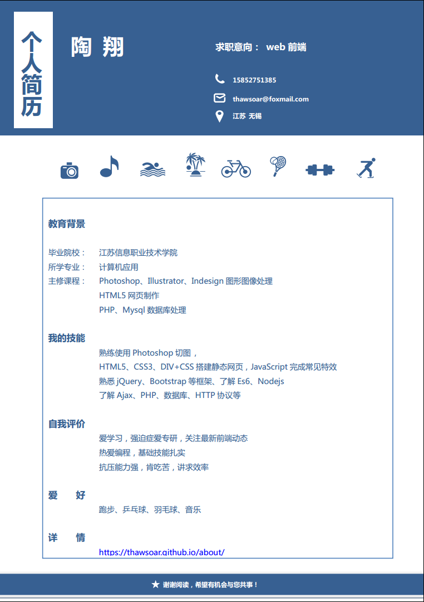

#### 关于我
>- 我是一只前端航线上的小菜鸟，想要飞却怎么也飞不高！
>- 但我坚信十万个小时天才理论，相信在某一天我也能够飞到高空!

#### 关于blog
>- 捡拾前辈们的羽翼，记录生活中的点滴 ！
>- 分享blog里一切的一切！

#### 联系方式
>- 姓名: 小翔同学
>- 电话: 15852751385
>- QQ：1306750238
>- Email：thawsoar@foxmail.com

#### 所学专业：
>- 乱七八糟

#### 主修课程：  	
>- Photoshop、Illustrator、Indesign图形图像处理
>- Html5网页制作
>- PHP、mysql数据库处理

#### 我的技能  
>- 熟练使用Photoshop切图，HTML5、CSS3、DIV+CSS 搭建静态网页
>- JavaScript完成常见网页效果
>- 熟悉jQuery、bootstrap等框架、了解Es6、nodejs
>- 了解Ajax、PHP、数据库、HTTP协议

#### 自我评价  
>- 爱学习，关注最新前端动态
>- 热爱编程，基础技能扎实
>- 抗压能力强，肯吃苦，讲求效率

#### 小小简历:
>- 快要实习了哟！

>